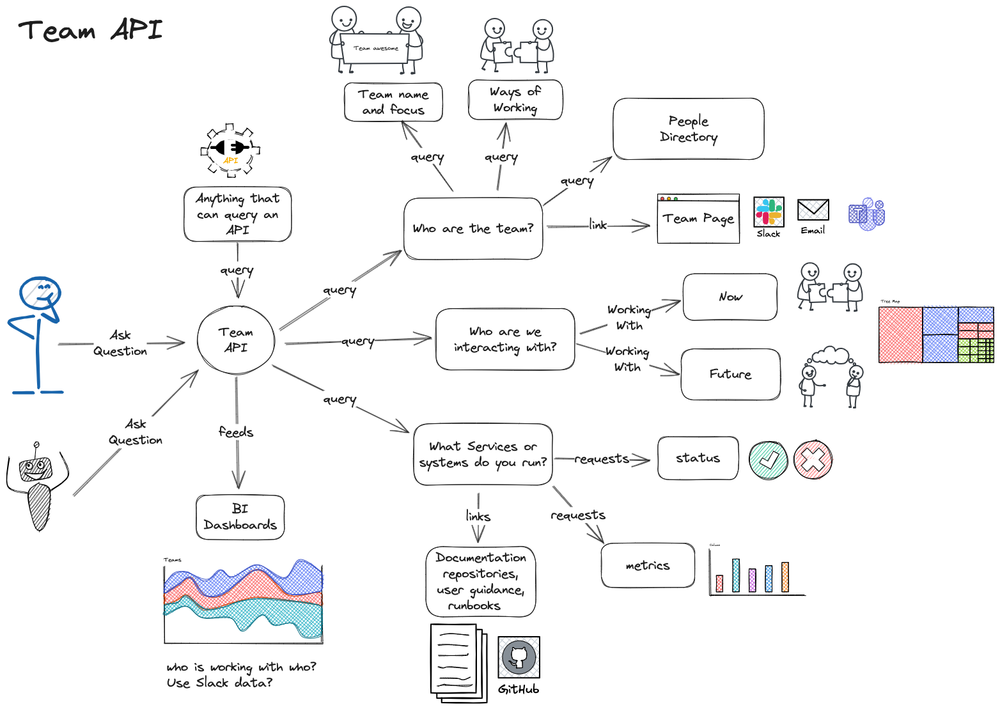

# Team API: Enhancing Team Clarity and Collaboration

Defining a **Team API** provides a shared understanding of a team's purpose, responsibilities, and ways of working. It serves as a "contract" between the team and the broader organisation, enabling seamless collaboration, reducing misunderstandings, and aligning efforts effectively.

This repository offers a framework for creating your team's **Team API** and guidance on embedding it into everyday operations.

---

## 🔍 What is a Team API?

A **Team API** is a document that acts as the "interface" for your team, similar to how a software API specifies how systems interact. It explicitly defines:

1. **Mission**: Why the team exists and the value it brings.
2. **Capabilities**: What the team delivers and how it contributes to organisational goals.
3. **Interfaces**: How others can interact with the team and what they can expect.
4. **Expectations**: Dependencies and support needed from others to operate effectively.

### 📈 Visualising a Team API

Below is a diagram illustrating the key components of a Team API:

This visual representation highlights the flow of communication, collaboration, and dependencies within a Team API. It reinforces the concept of a structured interface between the team and its stakeholders.

---

## 🌐 Example Team API Site

Check out a **live example of a Team API**:  
👉 [Team API Example Site](https://bagg3rs.github.io/team-api/)

This site uses **Swagger** to present a Team API in a structured and interactive format. It is deployed as a static site, powered by **GitHub Actions**, making it easy to automate updates and ensure the documentation stays current.

### Benefits of This Approach:
- **Interactive Format**: Swagger provides a dynamic and user-friendly interface for exploring the Team API.
- **Version Control**: Hosted on GitHub, ensuring all changes are tracked and managed collaboratively.
- **Automation**: Utilises GitHub Actions to build and deploy the site automatically, ensuring minimal manual overhead.

### How It Works:
1. **Swagger Specification**: The Team API is defined using an OpenAPI-compliant Swagger spec.
2. **GitHub Actions Workflow**:
   - Automatically triggers builds when changes are committed to the repository.
   - Deploys the static site to GitHub Pages, making it accessible to everyone in the organisation.
3. **Static Site Hosting**: The site is hosted on GitHub Pages for fast, reliable access.

---

## 🛠 Why You Need a Team API

- **📢 Clear Communication**: Articulates your team's role and responsibilities for internal and external audiences.
- **📏 Defined Boundaries**: Prevents scope creep by outlining what the team is (and isn’t) responsible for.
- **🚀 Onboarding Made Easy**: Accelerates new members’ understanding of the team's purpose and ways of working.
- **🤝 Collaboration Simplified**: Reduces friction by setting clear expectations for interactions.
- **📈 Alignment & Accountability**: Ensures the team’s goals align with organisational priorities.

---

## 📝 Team API Template

Use the following structure to define your team’s API:

### 1. **Team Mission**
- **Purpose**: What does your team do, and why does it exist?
  - Example: *"We ensure the reliability and scalability of our customer-facing platforms to deliver exceptional user experiences."*
- **Outcomes**: What value does the team provide to the organisation?
  - Example: *"Minimising downtime and optimising system performance, supporting the company’s growth objectives."*

### 2. **Team Capabilities**
- **Core Deliverables**: The key services, products, or expertise your team provides.
  - Example: *"Automated CI/CD pipelines, platform observability tools, and system performance optimisation."*
- **Unique Expertise**: What sets your team apart?
  - Example: *"Deep knowledge in distributed systems and Kubernetes scalability."*

### 3. **Team Interfaces**
- **Communication Channels**: Preferred methods for interacting with the team.
  - Example: *"Use Slack for quick queries (#team-platform) and GitHub for feature requests."*
- **Collaboration Processes**: How others can engage with your team.
  - Example: *"Submit a support request via our Jira board with detailed requirements."*
- **Dependencies**: Teams, systems, or tools your team relies on.
  - Example: *"We depend on the IT Ops team for network configurations and the Product team for prioritisation guidance."*

### 4. **Expectations of Others**
- **Support Needed**: Resources or inputs required to succeed.
  - Example: *"Timely approval of infrastructure changes and clear project specifications."*
- **Commitments**: Any service level agreements (SLAs) or mutual expectations.
  - Example: *"We commit to resolving high-priority incidents within 2 hours if provided with all necessary details."*

### 5. **Team Metrics**
- **Measuring Success**: KPIs, OKRs, or other metrics.
  - Example: *"99.95% uptime for core systems and deployment pipeline success rates >95%."*
- **Feedback Mechanisms**: Channels for collecting and acting on feedback.
  - Example: *"Quarterly stakeholder surveys and a dedicated retrospective for major collaborations."*

---

## 🛠 Embedding the Team API in Everyday Work

To ensure your Team API remains a living, practical tool:

1. **📖 Make it Visible**: Publish your Team API in a centralised location (e.g., Confluence, GitHub, or your team wiki).
2. **♻️ Regularly Update**: Revisit and refine the API during quarterly reviews or after significant team changes.
3. **👩‍💻 Use in Planning**: Refer to the API during sprint planning, retrospectives, and cross-team collaborations.
4. **🤝 Build Feedback Loops**: Actively seek and incorporate feedback from stakeholders and team members.
5. **📚 Incorporate into Onboarding**: Use the API as a key resource when onboarding new team members or collaborating teams.

---

## 🎓 Resources & Acknowledgements

This framework is inspired by the **[Team API Template](https://github.com/TeamTopologies/Team-API-template#readme)** by Team Topologies. Explore their work to learn more about team dynamics and modern organisational design.

For a live example of a Swagger-based Team API site, visit 👉 [https://bagg3rs.github.io/team-api/](https://bagg3rs.github.io/team-api/).

---

By defining and maintaining a robust Team API, you can transform how your team operates and collaborates across the organisation. 🚀
